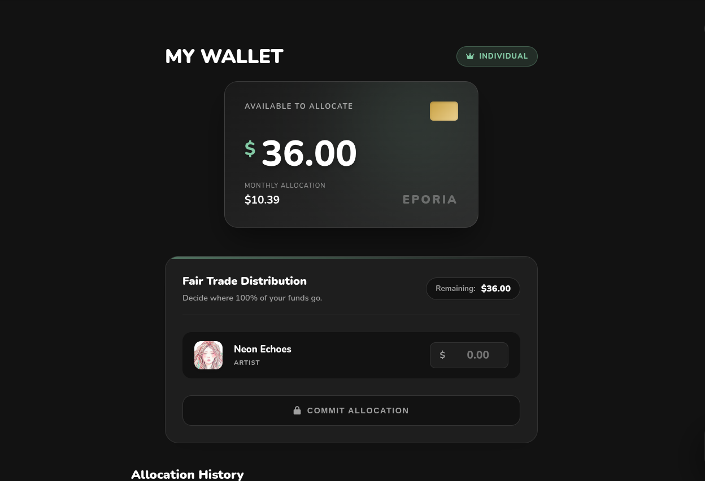
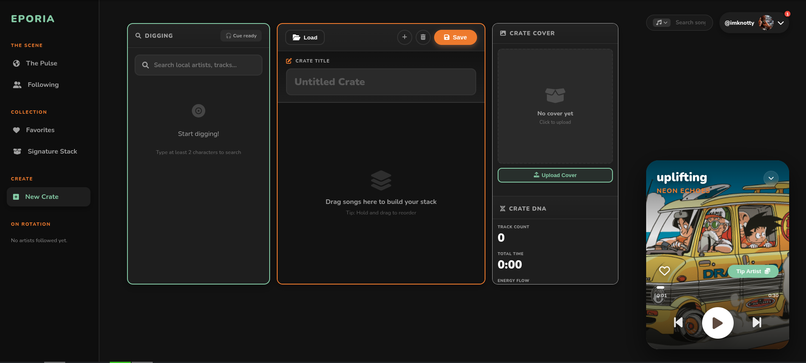
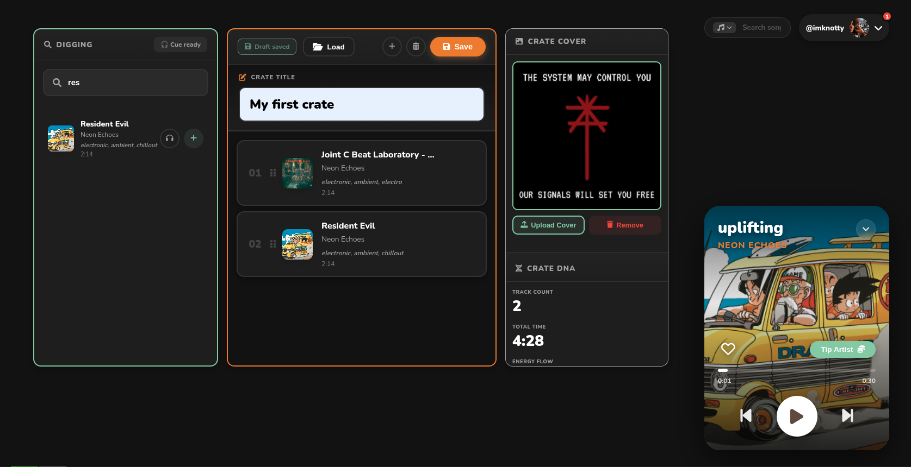

# Eporia

**The Pulse of the Underground.**

Eporia is a next-generation music discovery and streaming platform focused on localized scenes ("The Scene") and a transparent, user-directed "Fair Trade" monetization model. Unlike traditional streaming services, Eporia empowers listeners to directly allocate their subscription funds to the artists they support.

## 🚀 Key Features

### 🌍 The Scene (Dashboard)
A hyper-localized discovery engine that connects listeners with their local underground.
**Fresh Drops:** Real-time feed of new track uploads in the user's city.
**Community Crates:** User-curated playlists ("Crates") from local tastemakers.
**Active Artists:** Spotlight on artists currently active in the local scene.
**Teleport:** Ability to switch cities and explore scenes in different locations via the "Change City" modal.

### 💸 Fair Trade Wallet
A revolutionary financial model where 80% of the user's subscription fee goes directly to the artists they choose.
**Monthly Allocation:** Users view their available balance derived from their subscription plan (Discovery, Supporter, or Champion).
**Direct Support:** An interface to distribute funds explicitly to followed artists.
**Receipt History:** Transparent transaction logs showing exactly where funds were sent


*Allocate to the artists you appreciate.*

### 🎛️ The Workbench: Reimagining the Mixtape
Eporia's **Workbench** is not your standard playlist builder. It is a tactile, crate-digging studio designed to bring the joy of mixtape creation into the digital age. We moved away from static lists to create an interactive environment where building a "Stack" feels like a session behind the decks.

**1. Digging & Discovery**
The left panel simulates the "crate digging" experience. Users can search the entire database or filter by their local scene.
* **Cue Ready:** Preview tracks instantly with a dedicated cue channel before adding them to your stack.
* **Contextual Search:** Find tracks by artist, genre, or vibe without leaving the workflow.


*The blank canvas. Ready for your curation.*

**2. Building the Stack (Interactive DNA)**
Drag and drop tracks into the center stage to build your crate. As you add music, the **Crate DNA** panel on the right updates in real-time.
* **Energy Flow:** Visualize the tempo and energy progression of your mix.
* **Smart Metadata:** Automatically calculates total runtime and dominant genres.
* **Visual Identity:** Upload custom cover art to give your crate a unique brand in the feed.


*The Workbench in action: Analyzing track data and organizing the flow.*

**3. The Result: A Living Collection**
Once saved, crates become part of the community ecosystem. They aren't just lists; they are shareable, playable artifacts that represent your taste and contribution to the scene.

### 🎧 Professional Audio Engine
Built on top of **Tone.js**, the Eporia player offers DJ-grade audio control directly in the browser.
* **Dual Deck Architecture:** Simulates A/B decks for seamless transitions.
* **Crossfader & Limiter:** Smooth crossfading between tracks and built-in compressor/limiter for consistent volume.
* **3-Band EQ:** Real-time High, Mid, and Low frequency adjustments accessible via settings.
* **Gapless Playback:** Smart queue management with pre-loading.

### 👤 Profiles & Social
**Signature Stack:** A pinned collection of a user's created and liked crates.
**Anthem:** Users can select a "profile song" that represents them.
**Roles:** Distinct `User`, `Artist`, and `Admin` roles with specific privileges.
**Notifications:** Real-time alerts for follows and interactions via the profile dropdown.

---

## 🛠 Tech Stack

### Backend
* **Runtime:** Node.js
* **Framework:** Express.js
* **Database:** Firebase Firestore (NoSQL)
* **Storage:** Firebase Storage (GCP Bucket) for media and assets
* **Authentication:** Firebase Auth (Identity Platform)
* **Audio Analysis:** Essentia.js & Fluent-FFmpeg for track analysis

### Frontend
**Templating:** Pug (Server-side rendering with client-side hydration).
**Styles:** Custom CSS3 with CSS Variables for theming (Light/Dark mode).
**Audio:** Tone.js (Web Audio API wrapper).
**Image Processing:** Cropper.js for avatar and cover art adjustments.
**Architecture:** Class-based `PlayerUIController` for managing SPA-like state and DOM updates.

---

## 📂 Project Structure

├── public/ │ ├── javascripts/ │ │ ├── audioEngine.js # Tone.js wrapper for playback logic │ │ ├── uiController.js # Main frontend controller (hydration, events) │ │ └── enhancedPlayer.js # Entry point │ └── stylesheets/ │ ├── playerStyle.css # Core variables and component styles │ ├── rightSideBar.css # Player controls and profile menu │ ├── profile.css # Profile and hero styles │ ├── crate_view.css # Styles for single crate view │ └── wallet.css # Financial dashboard styles ├── routes/ │ └── player.js # Main Express router & API endpoints ├── views/ │ ├── player_shell.pug # Main layout wrapper │ ├── dashboard.pug # "The Scene" homepage │ ├── profile.pug # User/Artist profile page │ ├── wallet.pug # Fair Trade Wallet page │ ├── crate_view.pug # Single crate details │ └── partials/ # Sidebar components │ ├── left_sidebar.pug │ └── right_sidebar.pug └── app.js # Application entry point


---

## ⚡️ Getting Started

### Prerequisites
* Node.js (v14+)
* Firebase Admin SDK credentials (`serviceAccountKey.json`)

### Installation

1.  **Clone the repository**
    ```bash
    git clone [https://github.com/yourusername/eporia.git](https://github.com/yourusername/eporia.git)
    cd eporia
    ```

2.  **Install Dependencies**
    Run the following command to install all required packages listed in `package.json`:
    ```bash
    npm install
    ```

    **Key dependencies installed include:**
    * `express` & `pug`: Core server and templating engine.
    * `firebase-admin`: For backend interaction with Firestore and Auth.
    * `multer`: For handling file uploads (images/audio).
    * `fluent-ffmpeg` & `@ffmpeg-installer/ffmpeg`: For audio processing.
    * `essentia.js`: For client/server-side audio analysis (BPM, key).
    * `music-metadata`: For parsing ID3 tags from uploads.

3.  **Configure Firebase**
    Place your `serviceAccountKey.json` in the root directory. This is required for the backend to communicate with Firestore and Firebase Auth.

4.  **Run the Server**
    ```bash
    npm start
    ```
    The app will run at `http://localhost:3000`.

---

## 🔒 Security

**Hybrid Authentication:** Middleware verifies Firebase ID tokens for both API calls (Strict Mode) and Page Loads (Lenient Mode).
**Role-Based Access:** Specific routes (like admin controls) are protected by database role checks.
**Secure Uploads:** Uses `multer` in memory storage to stream files directly to Firebase Storage without touching the local disk.

---

## 🤝 Contributing

1.  Fork the Project
2.  Create your Feature Branch (`git checkout -b feature/AmazingFeature`)
3.  Commit your Changes (`git commit -m 'Add some AmazingFeature'`)
4.  Push to the Branch (`git push origin feature/AmazingFeature`)
5.  Open a Pull Request